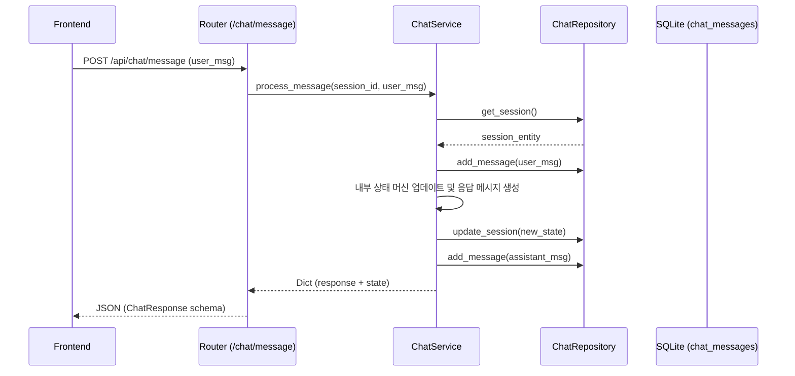

# MathVideo AI - 시스템 아키텍처 가이드

본 문서는 ProjectEbsMathVideo의 전반적인 아키텍처 및 시스템 레이어를 설명합니다.

## 디렉토리 구조 (Backend)

```text
backend/
├── app/
│   ├── main.py              # FastAPI 진입점 (미들웨어 및 라우터 마운트)
│   ├── config.py            # 환경 변수 및 공통 설정 (pydantic-settings)
│   ├── database.py          # SQLAlchemy 엔진 및 DB 세션 관리
│   ├── routers/             # [Controller] HTTP 핸들링 계층
│   │   ├── chat.py
│   │   ├── ebs.py
│   │   ├── playlist.py
│   │   └── youtube.py
│   ├── services/            # [Service] 비즈니스 로직 계층
│   │   ├── chat_service.py
│   │   ├── ebs_service.py
│   │   ├── playlist_service.py
│   │   └── youtube_service.py
│   ├── repositories/        # [Repository] 데이터 액세스 계층
│   │   ├── chat_repository.py
│   │   └── playlist_repository.py
│   ├── schemas/             # [DTO] Pydantic 데이터 검증 계층
│   │   ├── chat.py
│   │   ├── ebs.py
│   │   ├── playlist.py
│   │   └── youtube.py
│   └── models/              # [Entity] SQLAlchemy 데이터베이스 모델
│       └── domain.py
├── tests/                   # [Test] 단위 테스트 모듈 (pytest)
└── data/                    # SQLite DB 및 정적 JSON 데이터
```

## 핵심 설계 패턴: Controller-Service-Repository

의존성 역전 원칙(DIP)과 단일 책임 원칙(SRP)을 준수하기 위해 3계층 아키텍처를 도입했습니다.

1. **Controller (Routers)**
   - HTTP 요청과 응답, Pydantic Schema를 통한 데이터 검증(Validation)을 담당합니다. 
   - 비즈니스 로직을 전혀 알지 못하며 오직 서비스(Service) 레이어의 함수를 호출하여 값을 리턴합니다.
2. **Service**
   - 핵심 비즈니스 로직이 들어가는 곳입니다.
   - 데이터 검증이나 HTTP 세부 사항에서 분리되어 있으며 Repository로부터 데이터를 전달받아 처리합니다. (ex. EBS 강좌의 점수 기반 추천)
3. **Repository**
   - 오직 DB나 저장매체의 입출력(C/R/U/D)만 다룹니다.
   - SQLAlchemy의 Session을 직접 주입받아 데이터 입출력을 캡슐화합니다.

## 데이터 워크플로우 예시 (채팅 메시지)



## 외부 연동 (YouTube API) 아키텍처

- `httpx`를 이용해 비동기(Async) 방식의 non-blocking I/O 처리를 합니다.
- `tenacity` 라이브러리를 통해 외부 API 실패 시 재시도하도록 구성되어 있습니다.
- 환경 변수 `.env`에 키가 없을 경우 자동으로 MOCK 데이터로 fallback되어 시스템 장애를 유연하게 통과합니다.
